# AnyFlux Specification

**Version:** 0.1.0 (Draft)
**Date:** April 2026
**Title:** AnyFlux — A Lightweight, Cross-Platform, Cross-Language Filter Graph / Flow-Based Programming Library

---

## 1. Introduction

AnyFlux is a **filter graph** and **flow-based programming (FBP)** library designed for maximum portability and usability.

### Goals

1. **Easy to use** — Fluent APIs, JSON graphs, optional visual editing via FBP Protocol.
2. **Easy to implement** — Minimal, consistent core concepts across languages.
3. **Fast** — Zero-copy native typed paths; hybrid push/pull execution.
4. **Skinny** — Small footprint (<100 KB core where possible), no heavy dependencies, embedded-friendly.
5. **Extendable** — Dynamic component registration, plugins, hierarchical subgraphs, custom schedulers.

### Supported Platforms

- Desktop: Windows, macOS, Linux
- Embedded: FreeRTOS, Zephyr (and other RTOS)
- Languages: Native implementations in C/C++, Python, TypeScript/JavaScript, Go, PHP, and others via FFI.

### Design Philosophy

- **Native-first**: Each language has a fully idiomatic API while sharing identical core concepts.
- **Dual data paths**: Typed ports for performance + [`AVar`](https://github.com/visionik/anyvar) ([AnyVar](https://github.com/visionik/anyvar)) for cross-language interop.
- **FBP Protocol compatible**: Optional thin layer for visual editors (Flowhub) and testing (fbp-spec).
- **Separate concerns**: Execution core vs. control/visual layer.

### Architecture Overview

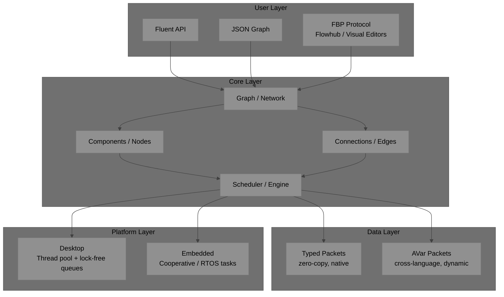

---

## 2. Core Concepts

### Concept Relationships

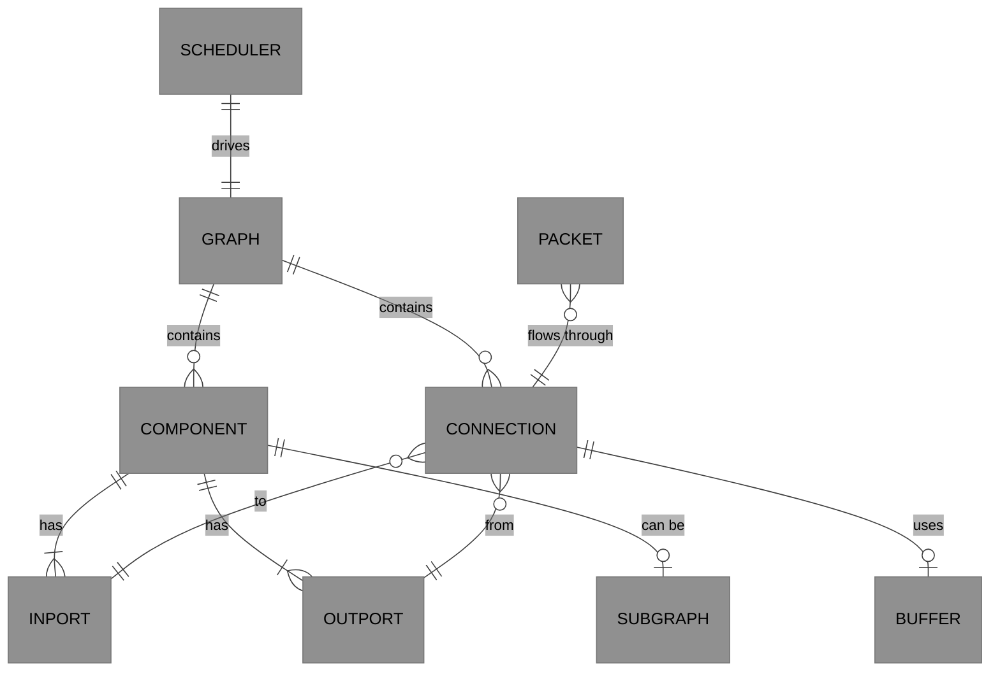

### 2.1 Packet / Value

The unit of data that flows through the graph.

- **Typed Packet** (`Packet<T>` or native type): For same-language, high-performance paths (zero-copy where possible).
- **AVar Packet** ([AnyVar](https://github.com/visionik/anyvar)): Cross-language / dynamic data.

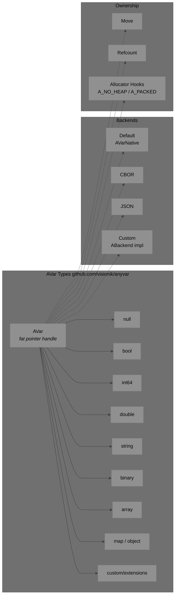

**AnyFlux uses [AnyVar](https://github.com/visionik/anyvar) v0.2 (`AVar`) as its canonical cross-language variant type.**

As of v0.2, `AVar` is a **fat pointer** (16 bytes on 64-bit): a `_backend` vtable pointer + opaque `_storage`. The default backend (`AVAR_DEFAULT_BACKEND`) is selected automatically on zero-initialisation — no extra parameters required. The original tagged union layout is now `AVarNative`, the internal representation of the default backend.

```c
/* AVar — universal fat-pointer handle (from github.com/visionik/anyvar v0.2)
 * Zero-initialise and call any a_var_set_*(); default backend selected automatically.
 * Never access _backend or _storage directly.
 */
typedef struct AVar {
    const ABackend* _backend;   /* NULL → AVAR_DEFAULT_BACKEND auto-selected */
    union {
        void*   _ptr;           /* heap-allocated backend data               */
        int64_t _i64;           /* inline scalar                             */
        double  _d;             /* inline scalar                             */
        uint8_t _buf[8];        /* small inline buffer                       */
    } _storage;
} AVar;

/* Built-in backends */
extern const ABackend AVAR_DEFAULT_BACKEND;  /* native C struct (AVarNative) */
extern const ABackend AVAR_CBOR_BACKEND;
extern const ABackend AVAR_JSON_BACKEND;

/* Usage — default backend, no extra params: */
AVar v = {0};
a_var_set_i64(&v, 42);
a_var_clear(&v);

/* Explicit backend (advanced): */
AVar v2;
a_var_init_with_backend(&v2, &AVAR_CBOR_BACKEND);
```

> See the [AnyVar specification](https://github.com/visionik/anyvar) for the full `ABackend` vtable, `AVarNative` internal layout, ownership model, and language bindings.
> Fast path: Bypass `AVar` entirely when types match and remain within the same language/process.

### 2.2 Ports

- **InPort** and **OutPort** — named (e.g., `"data"`, `"error"`).
- Support single ports and array ports (fan-in/fan-out).
- Typed or `AVar` mode.
- Pull-based interface (inspired by RAMEN) for embedded/low-overhead use: `Puller<T>` / `Pullable<T>`.

### 2.3 Component / Node

A black-box reusable processing unit.

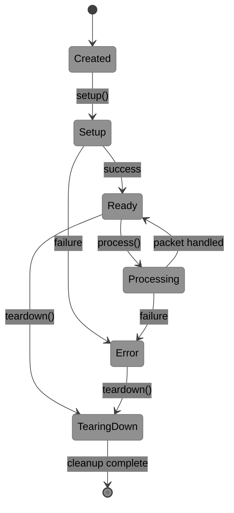

**Defined by:**

- Input ports + Output ports (with metadata: type hints, description).
- Processing logic (callback, method, or lambda).
- Lifecycle: `setup()`, `process()`, `teardown()`.
- Registration: Static (compile-time) or dynamic (`register("myfilter", MyFilter)`).
- Hierarchical: A whole subgraph can act as a Component.

### 2.4 Connection / Edge

- Directed link from an `OutPort` to an `InPort`.
- Bounded buffer with back-pressure.
- Optional direct (synchronous) pass-through for low-latency paths.

### 2.5 Graph / Network

- Container for Components + Connections.
- Supports:
  - Fluent builder API.
  - JSON serialization (standard FBP graph format).
  - Hierarchical subgraphs.
  - Introspection and runtime modification (add/remove nodes/edges while running where supported).

### 2.6 Scheduler / Engine

- Drives execution.
- Pluggable implementations.
- Hybrid push + pull model.
- Control methods: `start()`, `stop()`, `step()` (for testing), `run()` (blocking).

---

## 3. Data Flow

### Push vs Pull Execution

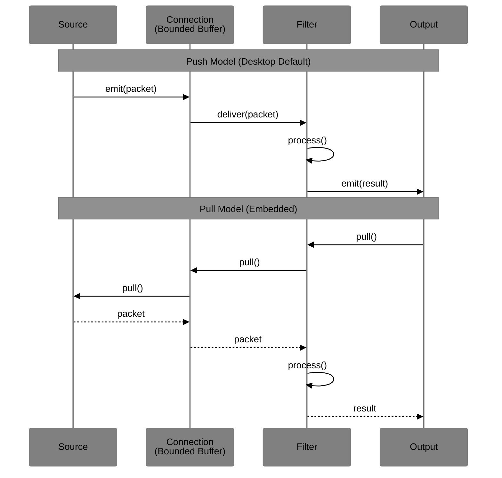

### Back-Pressure Flow

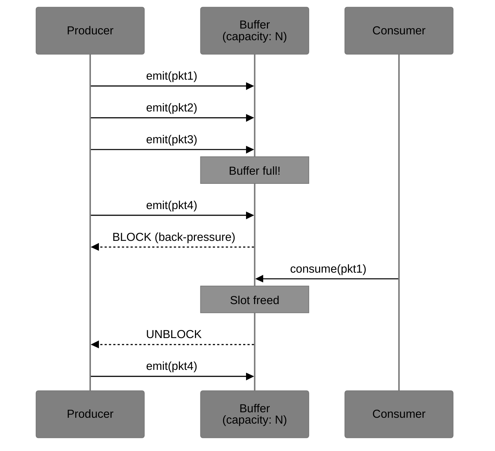

---

## 4. Graph JSON Format

AnyFlux uses the standard FBP JSON graph format for interoperability.

```json
{
  "properties": { "name": "My Audio Pipeline" },
  "processes": {
    "source": { "component": "core/Generator" },
    "filter": { "component": "myproject/LowPass" }
  },
  "connections": [
    {
      "src": { "process": "source", "port": "out" },
      "tgt": { "process": "filter", "port": "in" }
    }
  ],
  "inports": {},
  "outports": {}
}
```

> Supports IIPs (Initial Information Packets), groups, metadata, subgraphs.

### Example Pipeline Visualization

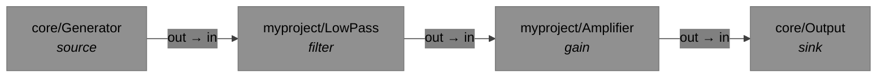

---

## 5. FBP Protocol Support

AnyFlux includes an optional, thin adapter for the FBP Network Protocol.

### Protocol Interaction

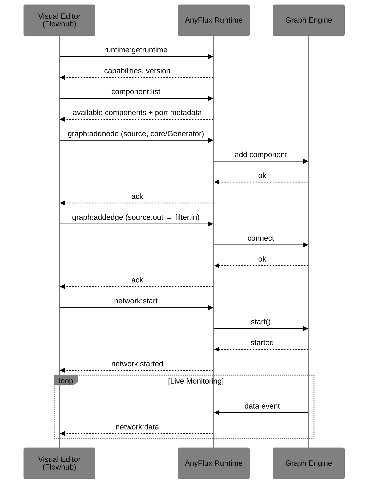

### Minimal Required Sub-Protocols

| Sub-Protocol | Purpose |
|---|---|
| `runtime` | Capabilities, version, runtime metadata |
| `graph` | Full CRUD on nodes, edges, IIPs, groups, subgraphs |
| `component` | List available components with port metadata |
| `network` | Start/stop, status, live data events, errors |

### Transport

- WebSocket (primary for desktop/browser)
- Serial/UART, custom channels for embedded
- Pluggable

### Capabilities Example

```json
{
  "protocol": "runtime",
  "command": "runtime",
  "payload": {
    "type": "anyflux",
    "version": "0.1.0",
    "capabilities": [
      "protocol:graph",
      "protocol:network",
      "protocol:component",
      "network:data"
    ]
  }
}
```

### Required Test Components (Core Collection)

| Component | Behavior |
|---|---|
| `Repeat` | Forwards input unchanged |
| `Drop` | Discards input |
| `Output` | Sends data to runtime outport or console |

> **Implementation Note:** The protocol handler is not in the hot data path. Internal typed/Variant packet passing remains fast and zero-copy. Protocol only handles control, editing, and optional live monitoring.

---

## 6. API Sketches (Idiomatic per Language)

### C++ (Header-only friendly)

```cpp
auto g = anyflux::Graph::create();
g->add<Adder>("adder");
g->connect("source.out", "adder.in");
g->start();
```

### Python

```python
g = anyflux.Graph()
g.add("myfilters.Adder", id="adder")
g.connect("source.out", "adder.in")
g.start()
```

### TypeScript

```typescript
const g = new anyflux.Graph();
g.add("adder", "myfilters/Adder");
g.connect("source.out", "adder.in");
await g.start();
```

---

## 7. Execution Models

### Scheduler Strategy by Platform

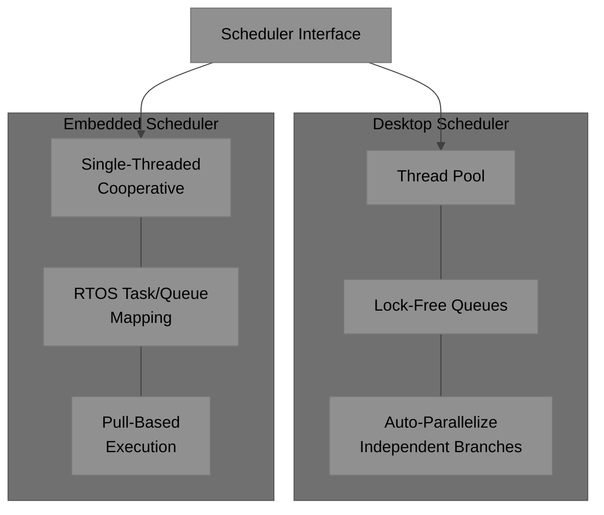

| Model | Description | Best For |
|---|---|---|
| **Push** | Data-driven (default for most desktop use) | Streaming, event processing |
| **Pull** | On-demand | Embedded, DSP, control loops |
| **Hybrid** | Push with pull-back for throttling | Mixed workloads |

- Automatic branch synchronization at merge points (inspired by DSPatch).
- Back-pressure via bounded connections.

---

## 8. Extendability Features

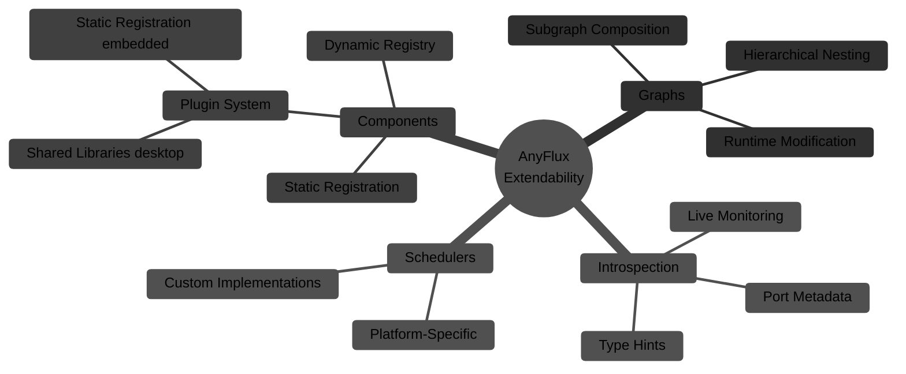

---

## 9. Embedded Considerations

- Compile-time flags to disable threads, exceptions, RTTI, heap usage.
- Static allocation pools for packets and nodes.
- Lightweight JSON parser for protocol (e.g., jsmn).
- Pull-based execution to minimize queues and context switches.
- `AVar` compile-time flags for embedded targets (defined in [AnyVar](https://github.com/visionik/anyvar)):

| Flag | Effect |
|---|---|
| `A_NO_HEAP` | Disable heap allocation; use static pools only |
| `A_PACKED` | Apply struct packing for minimal `AVarNative` size |
| `A_TYPE_U8` | Use `uint8_t` for `AVarType` instead of `uint32_t` |
| `A_CUSTOM_ALLOC` | Enable custom allocator hooks |
| `A_NO_MAP` | Disable `A_MAP` type (saves code size on tiny targets) |

### Desktop vs Embedded Feature Matrix

| Feature | Desktop | Embedded |
|---|---|---|
| Threading | Thread pool | Single-thread / RTOS tasks |
| Allocation | Heap (default) | Static pools |
| JSON parser | Full (nlohmann, etc.) | Minimal (jsmn) |
| Exceptions | Yes | Optional (compile flag) |
| RTTI | Yes | Optional (compile flag) |
| `AVar` ownership | Refcount | Move-only or static |
| Protocol transport | WebSocket | Serial/UART |
| Graph modification | Runtime | Compile-time preferred |

---

## 10. Implementation Roadmap

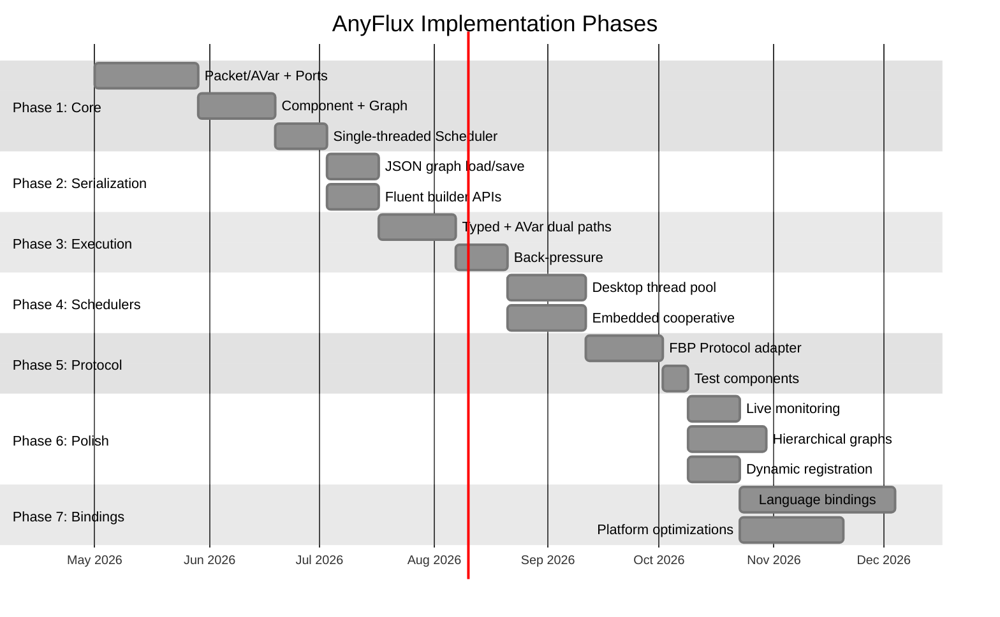

### Phase Summary

| Phase | Deliverables | Dependencies |
|---|---|---|
| **1. Core** | Packet/[AVar](https://github.com/visionik/anyvar), Ports, Component, Graph, single-threaded Scheduler | None |
| **2. Serialization** | JSON graph load/save, fluent builders | Phase 1 |
| **3. Execution** | Typed + AVar execution paths, back-pressure | Phase 2 |
| **4. Schedulers** | Pluggable schedulers (desktop vs embedded) | Phase 3 |
| **5. Protocol** | Minimal FBP Protocol adapter + test components | Phase 4 |
| **6. Polish** | Live monitoring, hierarchical graphs, dynamic registration | Phase 5 |
| **7. Bindings** | Language bindings and platform-specific optimizations | Phase 6 |

---

## 11. Non-Goals (for Skinny Design)

- Full distributed computing framework (use higher-level tools on top).
- Heavy visual editor built-in (rely on Flowhub via protocol).
- Built-in persistence or complex orchestration.

---

## 12. License & Open Source

AnyFlux is intended to be open source (**MIT/Apache 2.0** recommended) to encourage community components and bindings.

---

> This specification defines the shared foundation. Each language implementation must support the core concepts while providing native, idiomatic APIs. The FBP Protocol layer is optional but strongly recommended for visual tooling and ecosystem compatibility.
>
> **Feedback and contributions welcome.** Next steps: formalize `AVar` serialization (see [AnyVar](https://github.com/visionik/anyvar)), define exact component metadata schema, and prototype the C++ core.

---

## 13. Related Projects

- **[AnyVar](https://github.com/visionik/anyvar)** — The canonical cross-language, C-ABI-compatible variant type (`AVar`) used as AnyFlux's variant packet type. As of v0.2, `AVar` is a fat-pointer handle dispatching through a pluggable `ABackend` vtable; the original tagged union layout is `AVarNative` (default backend). Defines the full type system, ownership model, CBOR/JSON serialization backends, embedded compile flags, and language binding conventions.
