# AnyFlux C API

**Version:** 0.1.0 (Draft)
**ABI:** C11, `extern "C"` safe — FFI-compatible with C++, Python, Go, TypeScript, and others.

For complete function signatures, parameter descriptions, and struct field details see
[api-reference.md](./api-reference.md).

---

## 1. Architecture

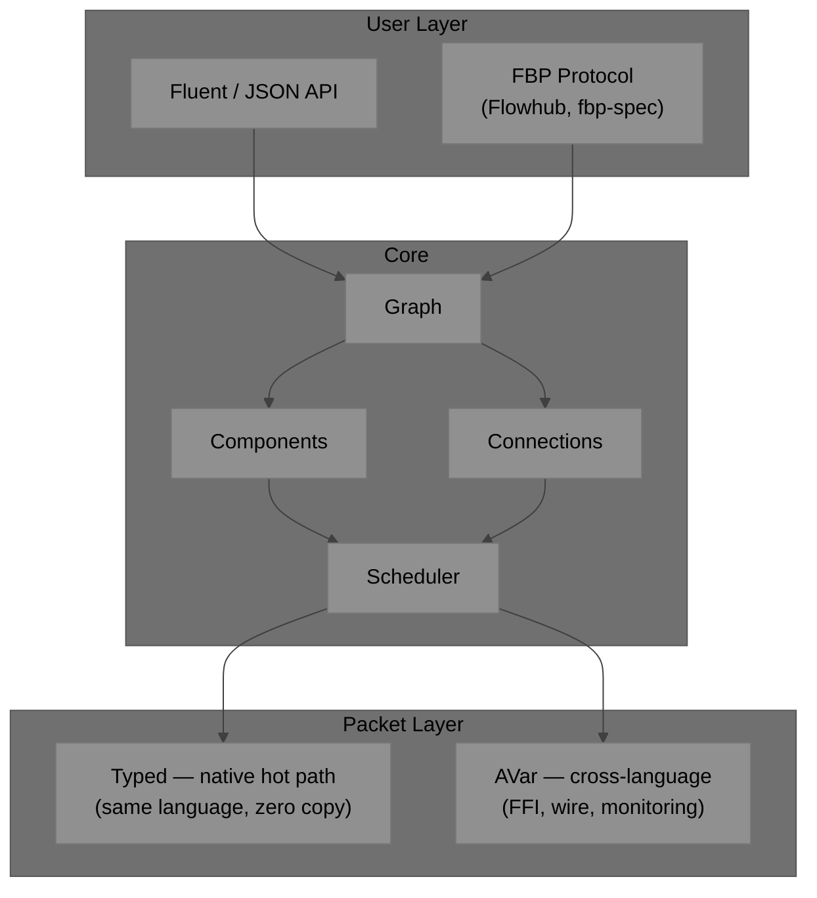

---

## 2. Conventions

### Naming

| Element | Pattern | Example |
|---|---|---|
| Opaque handle | `AF` + PascalCase | `AFGraph`, `AFComponent` |
| Function | `aFlux_` + camelCase | `aFlux_graphCreate` |
| Constant / macro | `AF_` + UPPER_SNAKE | `AF_OK`, `AF_ERR_OOM` |
| Callback typedef | `AF*Fn` | `AFProcessFn` |
| Descriptor struct | `AF*Desc` | `AFComponentDesc` |
| Vtable struct | `AF*Vtable` | `AFSchedulerVtable` |

### Error Codes

All functions return `AFStatus` (`int32_t`). `AF_OK = 0`; negatives are errors.

```c
#define AF_OK            0
#define AF_ERR_NULL     -1   /* NULL argument                           */
#define AF_ERR_OOM      -2   /* allocation failed                       */
#define AF_ERR_TYPE     -3   /* wrong AVar type                         */
#define AF_ERR_INVALID  -4   /* invalid argument or state               */
#define AF_ERR_NOT_FOUND -5  /* component / port / key not found        */
#define AF_ERR_BOUNDS   -6   /* index out of range                      */
#define AF_ERR_RUNNING  -7   /* not allowed while graph is running      */
#define AF_ERR_STOPPED  -8   /* not allowed while graph is stopped      */
#define AF_ERR_FULL     -9   /* connection buffer full (back-pressure)  */
#define AF_ERR_EMPTY   -10   /* port has no data (pull model)           */
#define AF_ERR_DUPLICATE -11 /* id or connection already exists         */
#define AF_ERR_BACKEND  -12  /* backend dispatch error                  */
```

### Ownership

- Handles from `*Create` are caller-owned; release with the matching `*Destroy`.
- Strings passed in are **borrowed** — AnyFlux copies what it needs.
- `AVar` packets passed to emit/send are **borrowed** — AnyFlux copies if it retains.
- `AVar` packets received in callbacks are **borrowed** — valid only during the callback.

---

## 3. Core Concepts

### 3.1 Component Anatomy

A component is a black-box processing unit. It owns named inports and outports, a `process`
callback that fires when a packet arrives on any inport, and a `userdata` pointer for state.

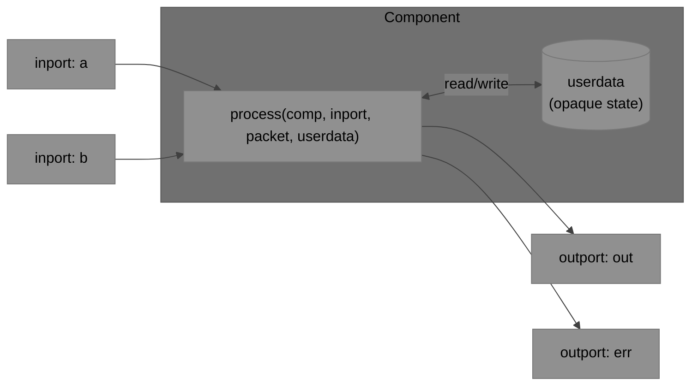

The callback receives the **name of the inport that fired** so a multi-input component can
dispatch:

```c
static AFStatus adder_process(AFComponent comp, const char* inport,
                               const AVar* packet, void* userdata)
{
    AdderState* s = userdata;
    if      (strcmp(inport, "a") == 0) { s->a = aVar_asDouble(packet); s->has_a = true; }
    else if (strcmp(inport, "b") == 0) { s->b = aVar_asDouble(packet); s->has_b = true; }

    if (s->has_a && s->has_b) {
        AVar out = {0};
        aVar_setDouble(&out, s->a + s->b);
        aFlux_componentEmit(comp, "out", &out);
        aVar_clear(&out);
        s->has_a = s->has_b = false;
    }
    return AF_OK;
}
```

### 3.2 Multiple Ports

Components can have any number of named inports and outports. Ports are declared in the
`AFComponentDesc` as arrays of `AFPortMeta`:

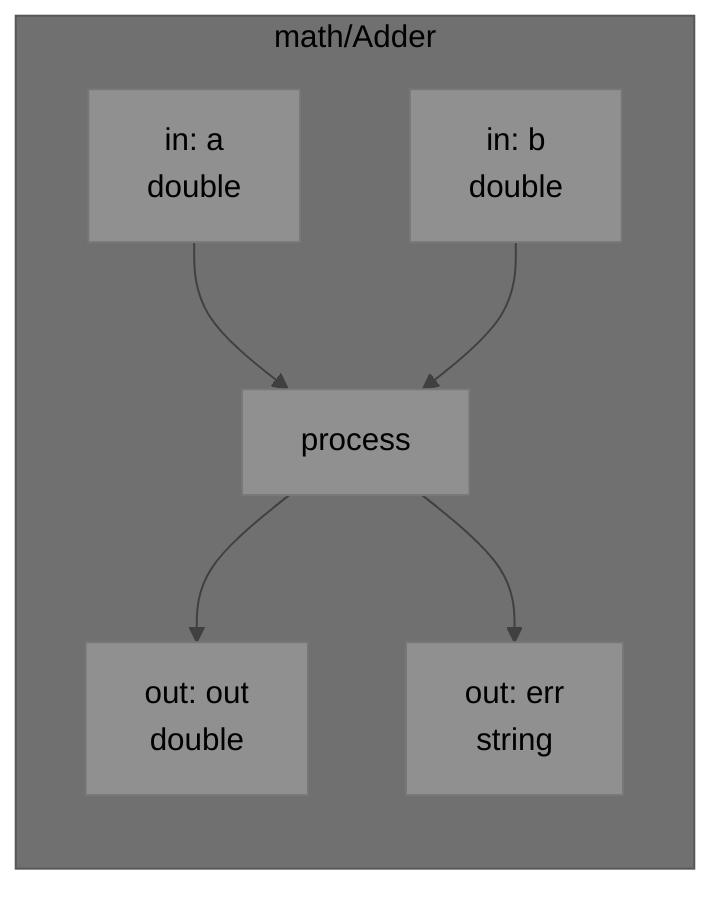

- Unconnected outports: `aFlux_componentEmit` is a no-op — no error.
- Optional inports: simply never fire if unconnected.
- A single `process` call may emit on multiple outports, or emit on the same outport multiple
  times.

### 3.3 Subgraphs

A subgraph is a complete `AFGraph` that acts as a component in a parent graph. Exposed ports
map external names to internal component ports. From the outside it is identical to a leaf
component.

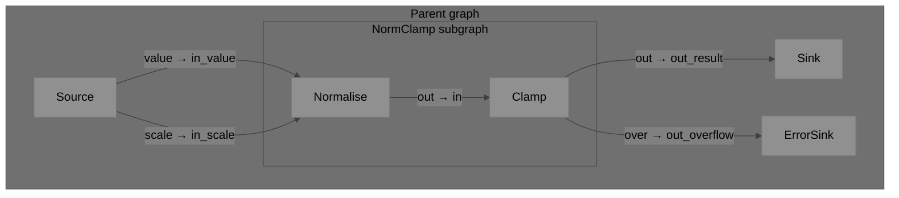

Key properties:
- `setup`/`teardown` propagate recursively into subgraphs.
- Back-pressure flows through exposed port boundaries as normal.
- Nesting is unlimited — subgraphs can contain subgraphs.
- Fan-in/fan-out at a boundary uses `core/Split` or `core/Merge` inside the subgraph.

### 3.4 Packets: AVar vs Native Types

`AVar` is required only at ABI boundaries. On hot paths within a single language, components
pass native types directly — zero conversion.

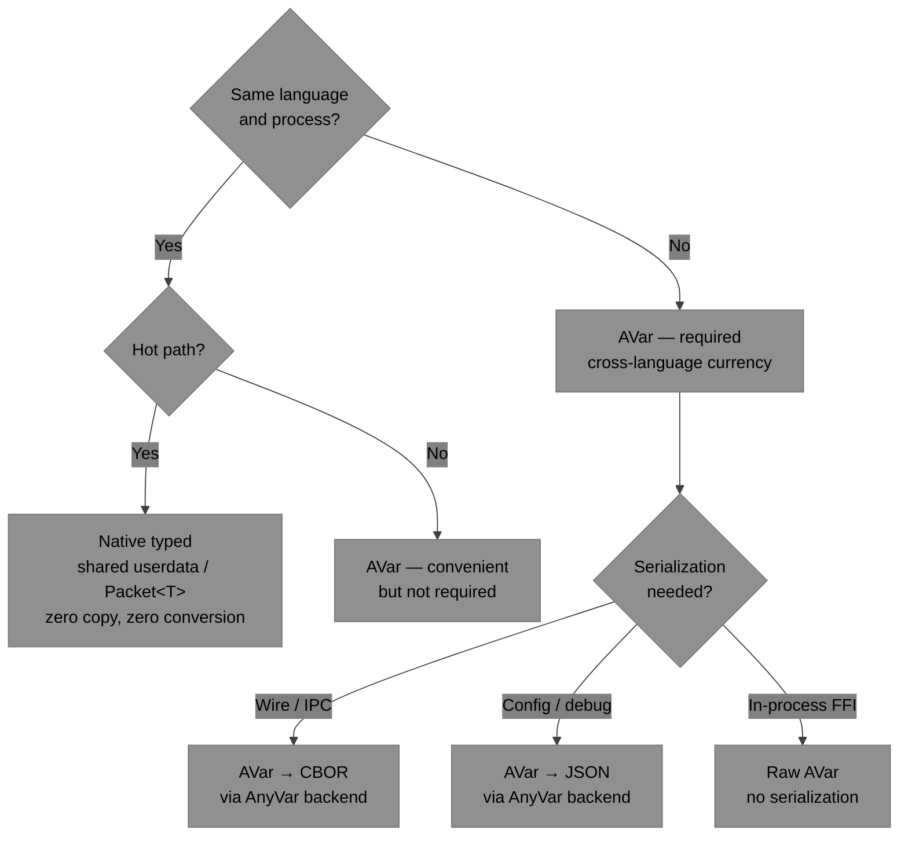

| Scenario | Packet type |
|---|---|
| C DSP hot loop, same process | Native `float*` / shared struct |
| C → Python via FFI | `AVar` |
| FBP Protocol wire | `AVar` → CBOR / JSON |
| Packet observer callback | Always `AVar` |
| Subgraph same-language boundary | Either — no crossing |

---

## 4. API Quick Reference

> Full signatures and parameter details: [api-reference.md](./api-reference.md)

### Graph

| Function | Description |
|---|---|
| `aFlux_graphCreate` | Create an empty, unnamed graph |
| `aFlux_graphCreateNamed` | Create a named graph |
| `aFlux_graphDestroy` | Destroy graph and all owned resources |
| `aFlux_graphAddComponent` | Add a component instance with a string id |
| `aFlux_graphRemoveComponent` | Remove a component by id |
| `aFlux_graphGetComponent` | Look up a component by id |
| `aFlux_graphConnect` | Connect two ports (default buffer capacity) |
| `aFlux_graphConnectBuffered` | Connect with explicit buffer capacity |
| `aFlux_graphDisconnect` | Remove a connection |
| `aFlux_graphSetIIP` | Set an Initial Information Packet on a port |
| `aFlux_graphClearIIP` | Clear an IIP |
| `aFlux_graphExposeInport` | Expose an internal port as a subgraph inport |
| `aFlux_graphExposeOutport` | Expose an internal port as a subgraph outport |
| `aFlux_graphState` | Query current run state |

### Component

| Function | Description |
|---|---|
| `aFlux_componentCreate` | Instantiate from an `AFComponentDesc` |
| `aFlux_componentDestroy` | Destroy component |
| `aFlux_componentGetPort` | Get a port handle by name and direction |
| `aFlux_componentEmit` | Emit a packet on a named outport (call from `AFProcessFn`) |
| `aFlux_componentUserdata` | Get userdata pointer |
| `aFlux_componentSetUserdata` | Replace userdata pointer |
| `aFlux_registerComponent` | Register a type in the global registry |
| `aFlux_createComponentByType` | Instantiate a registered type by name |

### Port

| Function | Description |
|---|---|
| `aFlux_portName` | Get port name string |
| `aFlux_portIsConnected` | Query connection status |
| `aFlux_portSend` | Push a packet into a port (push model) |
| `aFlux_portReceive` | Pull a packet from a port (pull/cooperative model) |
| `aFlux_portHasData` | Non-blocking data availability check |
| `aFlux_portBufferLen` | Current number of queued packets |
| `aFlux_portBufferCapacity` | Maximum buffer capacity |

### Scheduler / Execution

| Function | Description |
|---|---|
| `aFlux_schedulerCreateThreadPool` | Thread-pool scheduler (desktop default) |
| `aFlux_schedulerCreateSingleThread` | Single-threaded (testing / simple pipelines) |
| `aFlux_schedulerCreateCooperative` | Cooperative (embedded / RTOS) |
| `aFlux_schedulerCreateCustom` | Custom scheduler via `AFSchedulerVtable` |
| `aFlux_schedulerDestroy` | Destroy scheduler |
| `aFlux_run` | Blocking: setup → run → teardown |
| `aFlux_start` | Non-blocking start |
| `aFlux_stop` | Signal stop; drains in-flight packets |
| `aFlux_step` | Single step (cooperative / test) |
| `aFlux_wait` | Block until `AF_GRAPH_STOPPED` |

### Serialization

| Function | Description |
|---|---|
| `aFlux_graphToJSON` | Serialize graph to FBP JSON format |
| `aFlux_graphFromJSON` | Deserialize graph from FBP JSON |
| `aFlux_graphToCBOR` | Serialize graph to CBOR |
| `aFlux_graphFromCBOR` | Deserialize graph from CBOR |

### FBP Protocol Runtime

| Function | Description |
|---|---|
| `aFlux_runtimeCreate` | Create a protocol runtime adapter |
| `aFlux_runtimeDestroy` | Destroy runtime |
| `aFlux_runtimeBindTransport` | Attach a pluggable transport (WebSocket, serial, …) |
| `aFlux_runtimeHandleMessage` | Feed an incoming JSON protocol message |
| `aFlux_runtimeBindGraph` | Bind a graph + scheduler to the runtime |
| `aFlux_runtimeSetCapabilities` | Declare supported sub-protocol capabilities |

### Observability

| Function | Description |
|---|---|
| `aFlux_setPacketObserver` | Callback fired on every emitted packet |
| `aFlux_setErrorObserver` | Callback fired on component errors |
| `aFlux_setStateObserver` | Callback fired on graph state transitions |

---

## 5. Examples

### 5.1 Simple Two-Component Pipeline

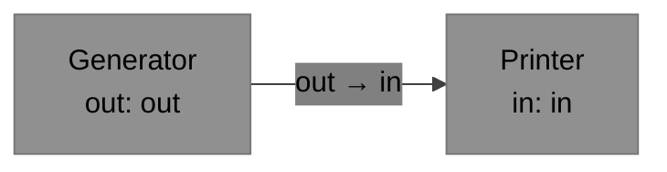

```c
static AFStatus gen_process(AFComponent comp, const char* p,
                             const AVar* pkt, void* ud)
{
    (void)p; (void)pkt; (void)ud;
    AVar out = {0};
    aVar_setI64(&out, 42);
    aFlux_componentEmit(comp, "out", &out);
    aVar_clear(&out);
    return AF_OK;
}

static AFStatus print_process(AFComponent comp, const char* p,
                               const AVar* pkt, void* ud)
{
    (void)comp; (void)p; (void)ud;
    printf("got: %lld\n", (long long)aVar_asI64(pkt));
    return AF_OK;
}

int main(void) {
    static const AFPortMeta gen_out[]  = {{"out", NULL, "int64", false}};
    static const AFPortMeta prn_in[]   = {{"in",  NULL, "any",   true }};

    AFComponent gen = aFlux_componentCreate(&(AFComponentDesc){
        .type_name="example/Gen", .outport_count=1, .outports=gen_out,
        .process=gen_process });
    AFComponent prn = aFlux_componentCreate(&(AFComponentDesc){
        .type_name="example/Print", .inport_count=1, .inports=prn_in,
        .process=print_process });

    AFGraph g = aFlux_graphCreate();
    aFlux_graphAddComponent(g, "gen", gen);
    aFlux_graphAddComponent(g, "prn", prn);
    aFlux_graphConnect(g, "gen","out", "prn","in");

    AFScheduler s = aFlux_schedulerCreateSingleThread();
    aFlux_run(g, s);
    aFlux_schedulerDestroy(s);
    aFlux_graphDestroy(g);
}
```

---

### 5.2 Multi-Input / Multi-Output Component

An adder that accumulates one packet on each of two inports before emitting. Emits on `err`
if a value is out of range.

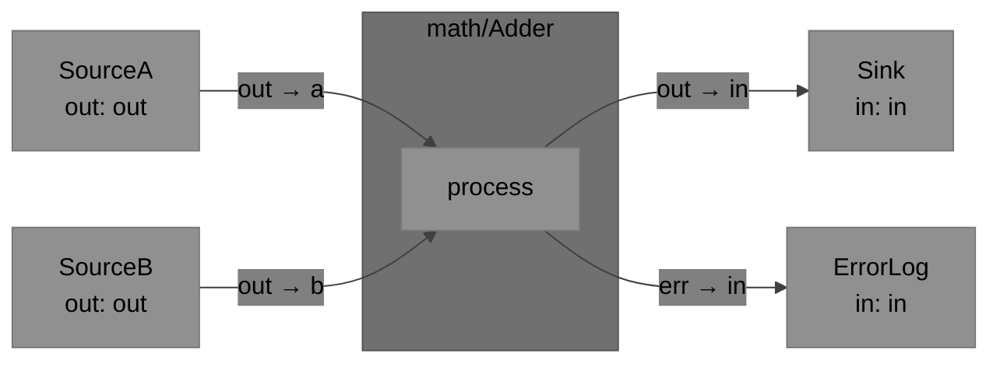

```c
typedef struct { double a, b; bool has_a, has_b; } AdderState;

static AFStatus adder_process(AFComponent comp, const char* inport,
                               const AVar* pkt, void* ud)
{
    AdderState* s = ud;
    if      (strcmp(inport, "a") == 0) { s->a = aVar_asDouble(pkt); s->has_a = true; }
    else if (strcmp(inport, "b") == 0) { s->b = aVar_asDouble(pkt); s->has_b = true; }

    if (!s->has_a || !s->has_b) return AF_OK;

    double sum = s->a + s->b;
    s->has_a = s->has_b = false;

    AVar out = {0};
    if (sum > 1e6) {
        aVar_setString(&out, "overflow", false);
        aFlux_componentEmit(comp, "err", &out);
    } else {
        aVar_setDouble(&out, sum);
        aFlux_componentEmit(comp, "out", &out);
    }
    aVar_clear(&out);
    return AF_OK;
}

/* Descriptor */
static const AFPortMeta adder_in[] = {
    {"a", "First operand",  "double", true},
    {"b", "Second operand", "double", true},
};
static const AFPortMeta adder_out[] = {
    {"out", "Sum",   "double", false},
    {"err", "Error", "string", false},
};
static AdderState adder_state = {0};
static const AFComponentDesc adder_desc = {
    .type_name     = "math/Adder",
    .inport_count  = 2, .inports  = adder_in,
    .outport_count = 2, .outports = adder_out,
    .process       = adder_process,
    .userdata      = &adder_state,
};
```

---

### 5.3 Three-Stage Pipeline with Error Branch

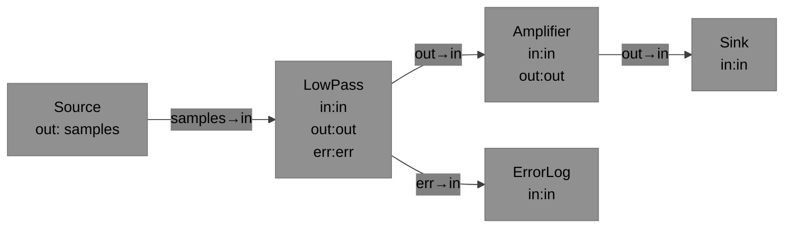

```c
int main(void) {
    AFComponent src    = aFlux_createComponentByType("dsp/Source");
    AFComponent lp     = aFlux_createComponentByType("dsp/LowPass");
    AFComponent amp    = aFlux_createComponentByType("dsp/Amplifier");
    AFComponent sink   = aFlux_createComponentByType("dsp/Sink");
    AFComponent errlog = aFlux_createComponentByType("core/Output");

    AFGraph g = aFlux_graphCreate();
    aFlux_graphAddComponent(g, "src",    src);
    aFlux_graphAddComponent(g, "lp",     lp);
    aFlux_graphAddComponent(g, "amp",    amp);
    aFlux_graphAddComponent(g, "sink",   sink);
    aFlux_graphAddComponent(g, "errlog", errlog);

    aFlux_graphConnect(g, "src",    "samples", "lp",     "in");
    aFlux_graphConnect(g, "lp",     "out",     "amp",    "in");
    aFlux_graphConnect(g, "lp",     "err",     "errlog", "in");
    aFlux_graphConnect(g, "amp",    "out",     "sink",   "in");

    /* IIP: set amplifier gain before start */
    AVar gain = {0};
    aVar_setDouble(&gain, 2.5);
    aFlux_graphSetIIP(g, "amp", "gain", &gain);
    aVar_clear(&gain);

    AFScheduler sched = aFlux_schedulerCreateThreadPool(4);
    aFlux_run(g, sched);
    aFlux_schedulerDestroy(sched);
    aFlux_graphDestroy(g);
}
```

---

### 5.4 Subgraph with Multiple Exposed Ports

Build a reusable `NormClamp` subgraph with two inports and two outports, then embed it in a
parent graph.

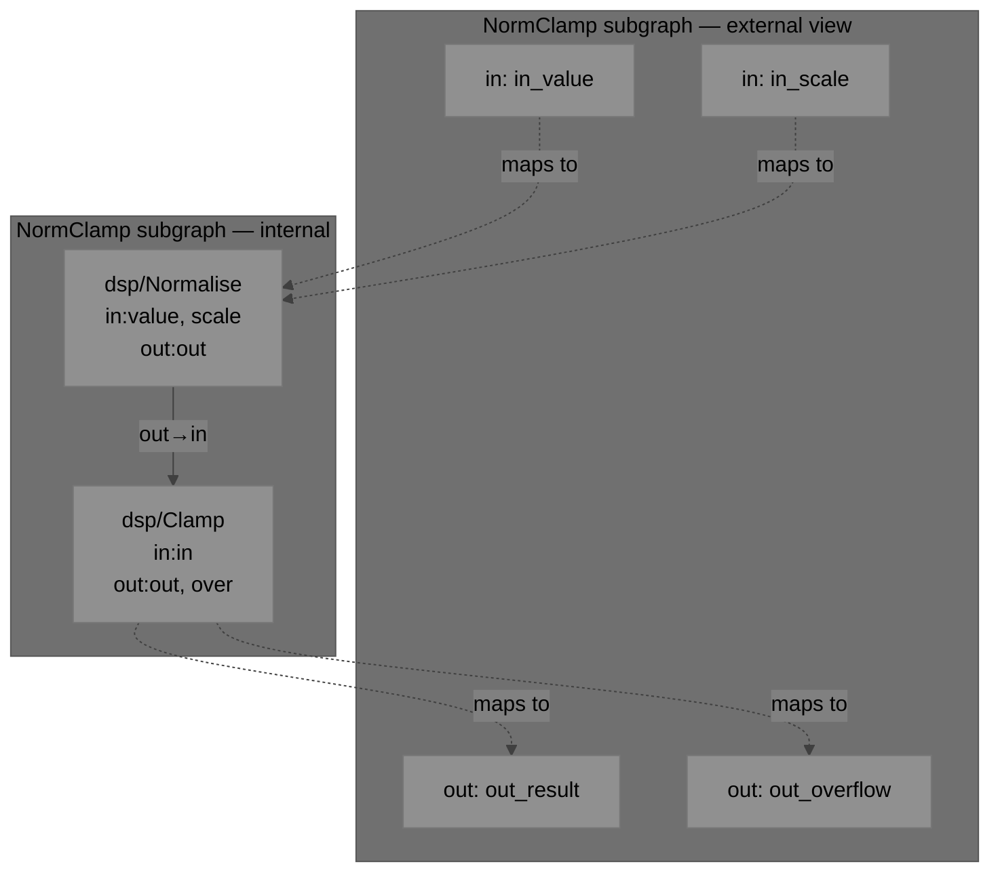

```c
/* Build the subgraph */
AFGraph sub = aFlux_graphCreateNamed("NormClamp");

AFComponent norm  = aFlux_createComponentByType("dsp/Normalise");
AFComponent clamp = aFlux_createComponentByType("dsp/Clamp");

aFlux_graphAddComponent(sub, "norm",  norm);
aFlux_graphAddComponent(sub, "clamp", clamp);
aFlux_graphConnect(sub, "norm", "out", "clamp", "in");

/* Expose external ports */
aFlux_graphExposeInport (sub, "in_value",    "norm",  "value");
aFlux_graphExposeInport (sub, "in_scale",    "norm",  "scale");
aFlux_graphExposeOutport(sub, "out_result",  "clamp", "out");
aFlux_graphExposeOutport(sub, "out_overflow","clamp", "over");

/* Embed in parent graph — sub is cast as AFComponent */
AFGraph parent = aFlux_graphCreate();

AFComponent src   = aFlux_createComponentByType("dsp/Source");
AFComponent cfg   = aFlux_createComponentByType("core/Config");
AFComponent sink  = aFlux_createComponentByType("dsp/Sink");
AFComponent esink = aFlux_createComponentByType("core/Output");

aFlux_graphAddComponent(parent, "src",   src);
aFlux_graphAddComponent(parent, "cfg",   cfg);
aFlux_graphAddComponent(parent, "proc",  (AFComponent)sub);
aFlux_graphAddComponent(parent, "sink",  sink);
aFlux_graphAddComponent(parent, "esink", esink);

aFlux_graphConnect(parent, "src",  "value",        "proc",  "in_value");
aFlux_graphConnect(parent, "cfg",  "scale",         "proc",  "in_scale");
aFlux_graphConnect(parent, "proc", "out_result",    "sink",  "in");
aFlux_graphConnect(parent, "proc", "out_overflow",  "esink", "in");

AFScheduler sched = aFlux_schedulerCreateThreadPool(2);
aFlux_run(parent, sched);
aFlux_schedulerDestroy(sched);
aFlux_graphDestroy(parent);   /* recursively destroys sub */
```

---

### 5.5 Native Typed Packets on the Hot Path

Within a single C process, components share state via `userdata` — no `AVar` on the critical
path. `AVar` is introduced only at the monitoring boundary.

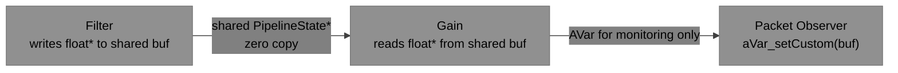

```c
/* Shared typed state — lives outside AVar entirely */
typedef struct {
    float   samples[1024];
    size_t  len;
    float   gain;
} PipelineState;

static AFStatus filter_process(AFComponent comp, const char* port,
                                const AVar* pkt, void* ud)
{
    PipelineState* s = ud;
    (void)comp; (void)port;
    /* Read input from AVar (at graph entry point), then work natively */
    s->len = aVar_asI64(pkt);   /* packet carries sample count */
    dsp_lowpass(s->samples, s->len);
    /* Emit a trivial "ready" signal so the next component fires */
    AVar ready = {0};
    aVar_setNull(&ready);
    aFlux_componentEmit(comp, "out", &ready);
    return AF_OK;
}

static AFStatus gain_process(AFComponent comp, const char* port,
                              const AVar* pkt, void* ud)
{
    PipelineState* s = ud;
    (void)comp; (void)port; (void)pkt;
    /* Read directly from shared buffer — zero conversion */
    for (size_t i = 0; i < s->len; i++) s->samples[i] *= s->gain;
    AVar out = {0};
    aVar_setCustom(&out, s->samples, false);   /* borrow — no copy */
    aFlux_componentEmit(comp, "out", &out);
    return AF_OK;
}
```

---

### 5.6 Complex Nested Pipeline

Two subgraphs chained together inside a parent; each subgraph has multiple ports.

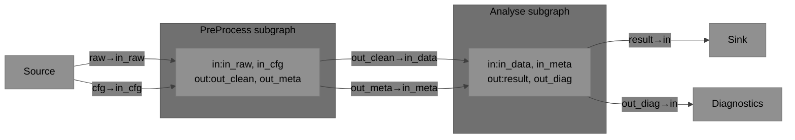

```c
/* Build PreProcess subgraph */
AFGraph pre = aFlux_graphCreateNamed("PreProcess");
/* ... add components, connections ... */
aFlux_graphExposeInport (pre, "in_raw",    "decode", "raw");
aFlux_graphExposeInport (pre, "in_cfg",    "decode", "cfg");
aFlux_graphExposeOutport(pre, "out_clean", "filter", "out");
aFlux_graphExposeOutport(pre, "out_meta",  "meta",   "out");

/* Build Analyse subgraph */
AFGraph ana = aFlux_graphCreateNamed("Analyse");
/* ... add components, connections ... */
aFlux_graphExposeInport (ana, "in_data",  "fft",    "in");
aFlux_graphExposeInport (ana, "in_meta",  "label",  "meta");
aFlux_graphExposeOutport(ana, "result",   "output", "out");
aFlux_graphExposeOutport(ana, "out_diag", "diag",   "out");

/* Parent */
AFGraph parent = aFlux_graphCreate();
aFlux_graphAddComponent(parent, "src",  aFlux_createComponentByType("io/Source"));
aFlux_graphAddComponent(parent, "pre",  (AFComponent)pre);
aFlux_graphAddComponent(parent, "ana",  (AFComponent)ana);
aFlux_graphAddComponent(parent, "sink", aFlux_createComponentByType("io/Sink"));
aFlux_graphAddComponent(parent, "diag", aFlux_createComponentByType("core/Output"));

aFlux_graphConnect(parent, "src", "raw",       "pre", "in_raw");
aFlux_graphConnect(parent, "src", "cfg",       "pre", "in_cfg");
aFlux_graphConnect(parent, "pre", "out_clean", "ana", "in_data");
aFlux_graphConnect(parent, "pre", "out_meta",  "ana", "in_meta");
aFlux_graphConnect(parent, "ana", "result",    "sink","in");
aFlux_graphConnect(parent, "ana", "out_diag",  "diag","in");

AFScheduler sched = aFlux_schedulerCreateThreadPool(4);
aFlux_run(parent, sched);
aFlux_schedulerDestroy(sched);
aFlux_graphDestroy(parent);
```

---

## 6. Built-in Core Components

Every AnyFlux implementation MUST provide:

| Type name | Inports | Outports | Behaviour |
|---|---|---|---|
| `core/Repeat` | `in` | `out` | Forwards packet unchanged |
| `core/Drop` | `in` | — | Discards packet silently |
| `core/Output` | `in` | — | Emits to runtime outport or stdout |
| `core/Split` | `in` | `out[N]` | Fans out to all connected outports |
| `core/Merge` | `in[N]` | `out` | Forwards from any connected inport |
| `core/Config` | — | `*` | Emits IIP values on named outports at start |

---

## 7. Embedded / Compile-Time Options

| CMake option | Preprocessor flag | Effect |
|---|---|---|
| `AF_NO_HEAP` | `AF_NO_HEAP` | Disable heap; use static allocation pools |
| `AF_NO_THREADS` | `AF_NO_THREADS` | Disable thread-pool scheduler and internal mutex |
| `AF_NO_PROTOCOL` | `AF_NO_PROTOCOL` | Exclude FBP Protocol adapter |
| `AF_NO_SERIALIZATION` | `AF_NO_SERIALIZATION` | Exclude JSON/CBOR graph serialization |
| `AF_NO_MAP` | `AF_NO_MAP` | Disable map packet type |
| `AF_STATIC_COMPONENTS` | `AF_STATIC_COMPONENTS` | Compile-time-only registry |
| `AF_MAX_COMPONENTS` | `AF_MAX_COMPONENTS=N` | Static registry size |
| `AF_MAX_CONNECTIONS` | `AF_MAX_CONNECTIONS=N` | Static connection pool size |
