# AnyFlux C API

**Version:** 0.1.0 (Draft)
**ABI:** C11, `extern "C"` safe — FFI-compatible with C++, Python, Go, TypeScript, and others.

For complete function signatures, parameter descriptions, and struct field details see
[api-reference.md](./api-reference.md).

---

## 1. Architecture

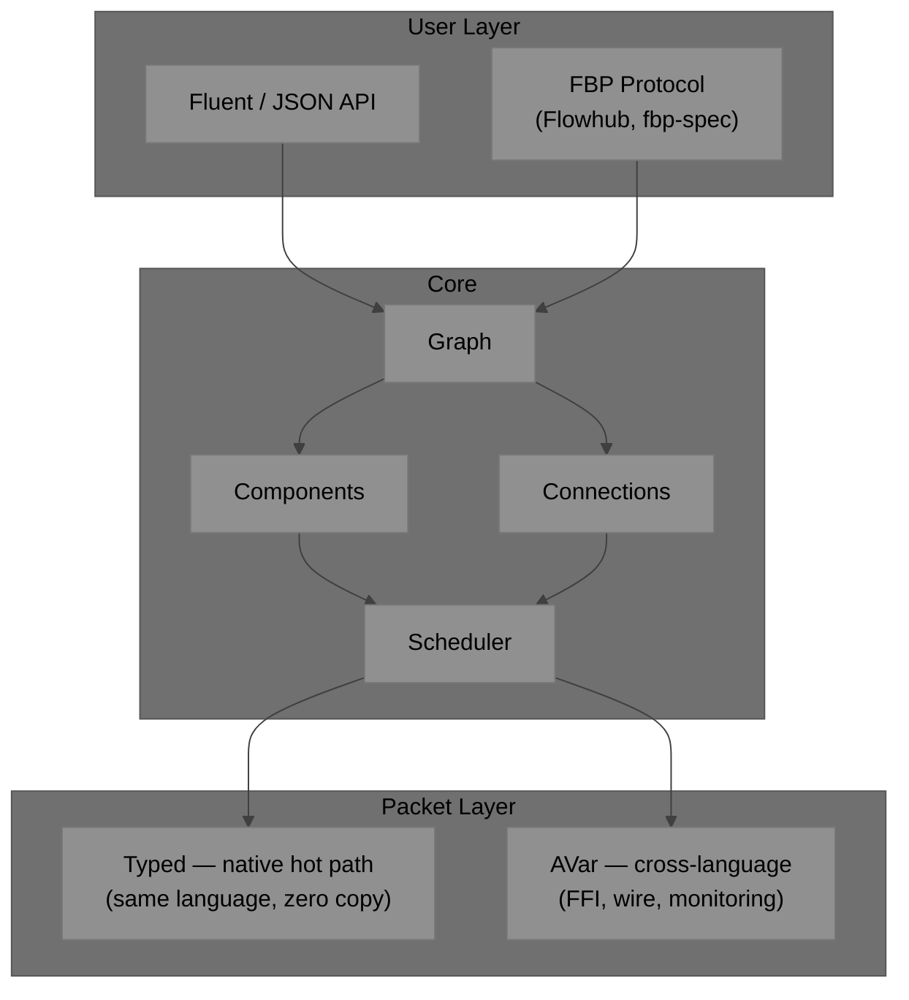

---

## 2. Conventions

### Naming

| Element | Pattern | Example |
|---|---|---|
| Opaque handle | `AF` + PascalCase | `AFGraph`, `AFComponent` |
| Function | `aFlux_` + camelCase | `aFlux_graphCreate` |
| Constant / macro | `AF_` + UPPER_SNAKE | `AF_OK`, `AF_ERR_OOM` |
| Callback typedef | `AF*Fn` | `AFProcessFn` |
| Descriptor struct | `AF*Desc` | `AFComponentDesc` |
| Vtable struct | `AF*Vtable` | `AFSchedulerVtable` |

### Error Codes

All functions return `AFStatus` (`int32_t`). `AF_OK = 0`; negatives are errors.

```c
#define AF_OK            0
#define AF_ERR_NULL     -1   /* NULL argument                           */
#define AF_ERR_OOM      -2   /* allocation failed                       */
#define AF_ERR_TYPE     -3   /* wrong AVar type                         */
#define AF_ERR_INVALID  -4   /* invalid argument or state               */
#define AF_ERR_NOT_FOUND -5  /* component / port / key not found        */
#define AF_ERR_BOUNDS   -6   /* index out of range                      */
#define AF_ERR_RUNNING  -7   /* not allowed while graph is running      */
#define AF_ERR_STOPPED  -8   /* not allowed while graph is stopped      */
#define AF_ERR_FULL     -9   /* connection buffer full (back-pressure)  */
#define AF_ERR_EMPTY   -10   /* port has no data (pull model)           */
#define AF_ERR_DUPLICATE -11 /* id or connection already exists         */
#define AF_ERR_BACKEND  -12  /* backend dispatch error                  */
```

### Ownership

- Handles from `*Create` are caller-owned; release with the matching `*Destroy`.
- Strings passed in are **borrowed** — AnyFlux copies what it needs.
- `AVar` packets passed to emit/send are **borrowed** — AnyFlux copies if it retains.
- `AVar` packets received in callbacks are **borrowed** — valid only during the callback.

---

## 3. Core Concepts

### 3.1 Component Anatomy

A component is a black-box processing unit. It owns named inports and outports, a `process`
callback that fires when a packet arrives on any inport, and a `userdata` pointer for state.

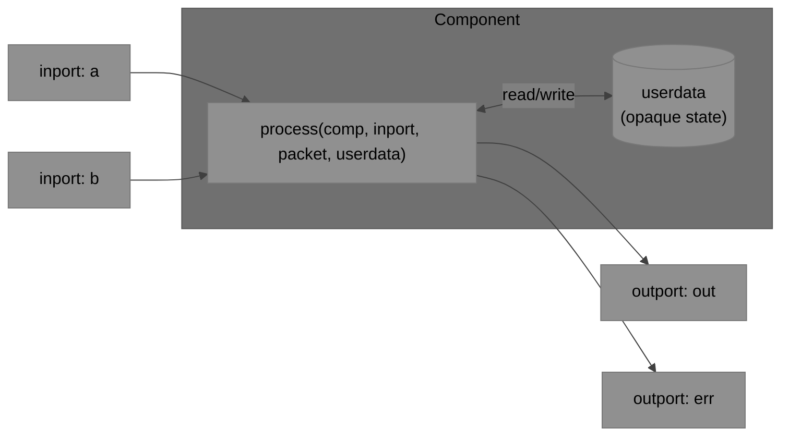

The callback receives the **name of the inport that fired** so a multi-input component
can dispatch across its inports. Upstream components write into the shared `userdata` state
before emitting a trigger; the adder just tracks readiness:

```c
/* Upstream sources write to shared state then emit a null trigger */
static AFStatus src_a_process(AFComponent comp, const char* in,
                               const AVar* pkt, void* ud)
{
    (void)in; (void)pkt;
    AdderState* s = ud;
    s->a = read_sensor_a();          /* native double — no AVar involved */
    aFlux_componentEmit(comp, "out", NULL);  /* NULL = null trigger, no AVar */
    return AF_OK;
}

/* Adder fires when both triggers have arrived */
static AFStatus adder_process(AFComponent comp, const char* inport,
                               const AVar* pkt, void* ud)
{
    (void)pkt;                       /* trigger carries no data — ignore it */
    AdderState* s = ud;
    if      (strcmp(inport, "a") == 0) s->has_a = true;
    else if (strcmp(inport, "b") == 0) s->has_b = true;
    if (!s->has_a || !s->has_b) return AF_OK;
    s->result  = s->a + s->b;        /* native arithmetic on shared state */
    s->has_a   = s->has_b = false;
    aFlux_componentEmit(comp, "out", NULL);
    return AF_OK;
}
```

See §5.4 for using `AVar` to carry data IN the packet instead of through shared state.

### 3.2 Multiple Ports

Components can have any number of named inports and outports. Ports are declared in the
`AFComponentDesc` as arrays of `AFPortMeta`:

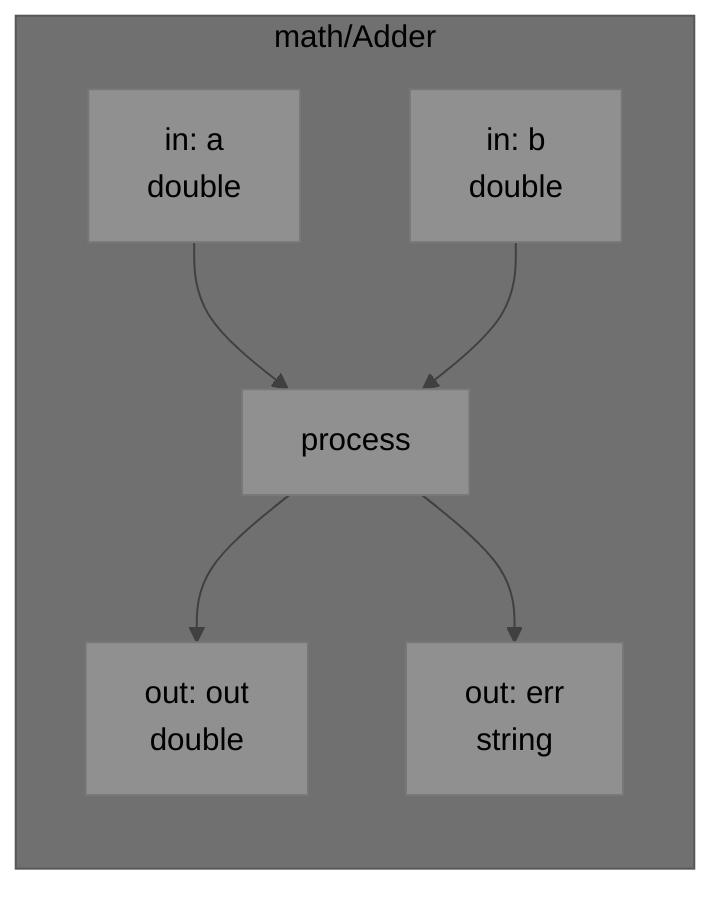

- Unconnected outports: `aFlux_componentEmit` is a no-op — no error.
- Optional inports: simply never fire if unconnected.
- A single `process` call may emit on multiple outports, or emit on the same outport multiple
  times.

### 3.3 Subgraphs

A subgraph is a complete `AFGraph` that acts as a component in a parent graph. Exposed ports
map external names to internal component ports. From the outside it is identical to a leaf
component.

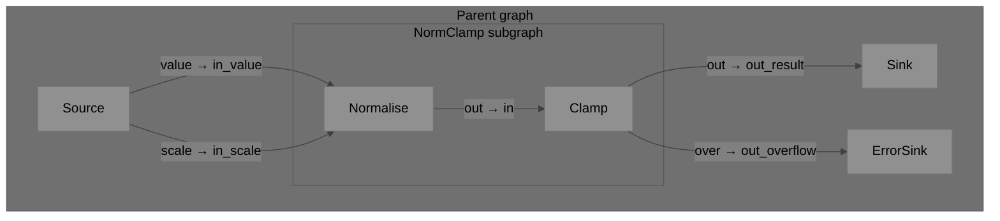

Key properties:
- `setup`/`teardown` propagate recursively into subgraphs.
- Back-pressure flows through exposed port boundaries as normal.
- Nesting is unlimited — subgraphs can contain subgraphs.
- Fan-in/fan-out at a boundary uses `core/Split` or `core/Merge` inside the subgraph.

### 3.4 Packets: AVar vs Native Types

`AVar` is required only at ABI boundaries. On hot paths within a single language, components
pass native types directly — zero conversion.

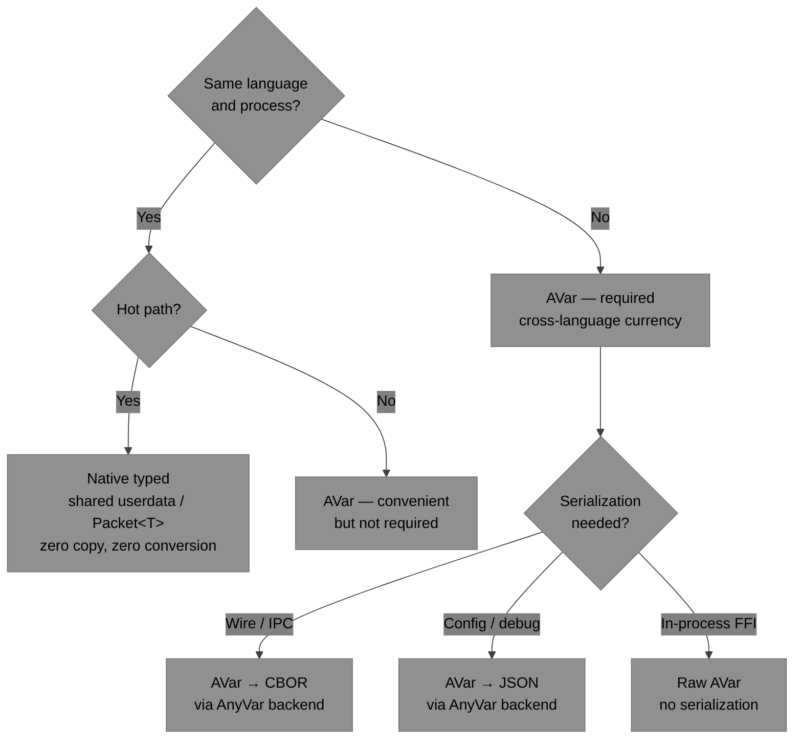

| Scenario | Packet type |
|---|---|
| C DSP hot loop, same process | Native `float*` / shared struct |
| C → Python via FFI | `AVar` |
| FBP Protocol wire | `AVar` → CBOR / JSON |
| Packet observer callback | Always `AVar` |
| Subgraph same-language boundary | Either — no crossing |

---

## 4. API Quick Reference

> Full signatures and parameter details: [api-reference.md](./api-reference.md)

### Graph

| Function | Description |
|---|---|
| `aFlux_graphCreate` | Create an empty, unnamed graph |
| `aFlux_graphCreateNamed` | Create a named graph |
| `aFlux_graphDestroy` | Destroy graph and all owned resources |
| `aFlux_graphAddComponent` | Add a component instance with a string id |
| `aFlux_graphRemoveComponent` | Remove a component by id |
| `aFlux_graphGetComponent` | Look up a component by id |
| `aFlux_graphConnect` | Connect two ports (default buffer capacity) |
| `aFlux_graphConnectBuffered` | Connect with explicit buffer capacity |
| `aFlux_graphDisconnect` | Remove a connection |
| `aFlux_graphSetIIP` | Set an Initial Information Packet on a port |
| `aFlux_graphClearIIP` | Clear an IIP |
| `aFlux_graphExposeInport` | Expose an internal port as a subgraph inport |
| `aFlux_graphExposeOutport` | Expose an internal port as a subgraph outport |
| `aFlux_graphState` | Query current run state |

### Component

| Function | Description |
|---|---|
| `aFlux_componentCreate` | Instantiate from an `AFComponentDesc` |
| `aFlux_componentDestroy` | Destroy component |
| `aFlux_componentGetPort` | Get a port handle by name and direction |
| `aFlux_componentEmit` | Emit a packet on a named outport (call from `AFProcessFn`) |
| `aFlux_componentUserdata` | Get userdata pointer |
| `aFlux_componentSetUserdata` | Replace userdata pointer |
| `aFlux_registerComponent` | Register a type in the global registry |
| `aFlux_createComponentByType` | Instantiate a registered type by name |

### Port

| Function | Description |
|---|---|
| `aFlux_portName` | Get port name string |
| `aFlux_portIsConnected` | Query connection status |
| `aFlux_portSend` | Push a packet into a port (push model) |
| `aFlux_portReceive` | Pull a packet from a port (pull/cooperative model) |
| `aFlux_portHasData` | Non-blocking data availability check |
| `aFlux_portBufferLen` | Current number of queued packets |
| `aFlux_portBufferCapacity` | Maximum buffer capacity |

### Scheduler / Execution

| Function | Description |
|---|---|
| `aFlux_schedulerCreateThreadPool` | Thread-pool scheduler (desktop default) |
| `aFlux_schedulerCreateSingleThread` | Single-threaded (testing / simple pipelines) |
| `aFlux_schedulerCreateCooperative` | Cooperative (embedded / RTOS) |
| `aFlux_schedulerCreateCustom` | Custom scheduler via `AFSchedulerVtable` |
| `aFlux_schedulerDestroy` | Destroy scheduler |
| `aFlux_run` | Blocking: setup → run → teardown |
| `aFlux_start` | Non-blocking start |
| `aFlux_stop` | Signal stop; drains in-flight packets |
| `aFlux_step` | Single step (cooperative / test) |
| `aFlux_wait` | Block until `AF_GRAPH_STOPPED` |

### Serialization

| Function | Description |
|---|---|
| `aFlux_graphToJSON` | Serialize graph to FBP JSON format |
| `aFlux_graphFromJSON` | Deserialize graph from FBP JSON |
| `aFlux_graphToCBOR` | Serialize graph to CBOR |
| `aFlux_graphFromCBOR` | Deserialize graph from CBOR |

### FBP Protocol Runtime

| Function | Description |
|---|---|
| `aFlux_runtimeCreate` | Create a protocol runtime adapter |
| `aFlux_runtimeDestroy` | Destroy runtime |
| `aFlux_runtimeBindTransport` | Attach a pluggable transport (WebSocket, serial, …) |
| `aFlux_runtimeHandleMessage` | Feed an incoming JSON protocol message |
| `aFlux_runtimeBindGraph` | Bind a graph + scheduler to the runtime |
| `aFlux_runtimeSetCapabilities` | Declare supported sub-protocol capabilities |

### Observability

| Function | Description |
|---|---|
| `aFlux_setPacketObserver` | Callback fired on every emitted packet |
| `aFlux_setErrorObserver` | Callback fired on component errors |
| `aFlux_setStateObserver` | Callback fired on graph state transitions |

---

Examples 5.1–5.3 use **native C types** only — data flows through shared `userdata` structs
and packets are null triggers carrying no data. Example 5.4 introduces `AVar` as the
alternative where data travels IN the packet.

### 5.1 Native: Simple Two-Component Pipeline

Two components share a `CounterState` via `userdata`. The packet is a null trigger — it
signals "ready" but carries no data.

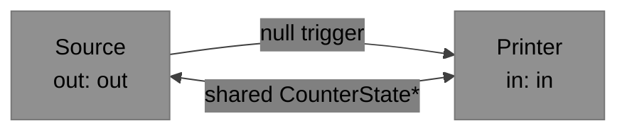

```c
typedef struct { int count; } CounterState;
static CounterState state = {0};

static AFStatus source_process(AFComponent comp, const char* in,
                                const AVar* pkt, void* ud)
{
    (void)in; (void)pkt;
    CounterState* s = (CounterState*)ud;
    s->count++;                              /* write native int to shared state */
    aFlux_componentEmit(comp, "out", NULL);  /* NULL = null trigger, no AVar */
    return AF_OK;
}

static AFStatus printer_process(AFComponent comp, const char* in,
                                 const AVar* pkt, void* ud)
{
    (void)comp; (void)in; (void)pkt;         /* trigger ignored — data is in shared state */
    CounterState* s = (CounterState*)ud;
    printf("count: %d\n", s->count);        /* read native int directly */
    return AF_OK;
}

int main(void) {
    static const AFPortMeta src_out[] = {{"out", NULL, NULL, false}};
    static const AFPortMeta prn_in[]  = {{"in",  NULL, NULL, true }};

    AFComponent src = aFlux_componentCreate(&(AFComponentDesc){
        .type_name="example/Source", .outport_count=1, .outports=src_out,
        .process=source_process, .userdata=&state });
    AFComponent prn = aFlux_componentCreate(&(AFComponentDesc){
        .type_name="example/Printer", .inport_count=1, .inports=prn_in,
        .process=printer_process, .userdata=&state });

    AFGraph g = aFlux_graphCreate();
    aFlux_graphAddComponent(g, "src", src);
    aFlux_graphAddComponent(g, "prn", prn);
    aFlux_graphConnect(g, "src", "out", "prn", "in");

    AFScheduler s = aFlux_schedulerCreateSingleThread();
    aFlux_run(g, s);
    aFlux_schedulerDestroy(s);
    aFlux_graphDestroy(g);
}
```

---

### 5.2 Native: Multi-Input / Multi-Output Component

Upstream sources write their values into shared `AdderState`, then emit a null trigger.
The adder fires when both triggers have arrived, computes on native doubles, and emits
on `out` or `err` accordingly.

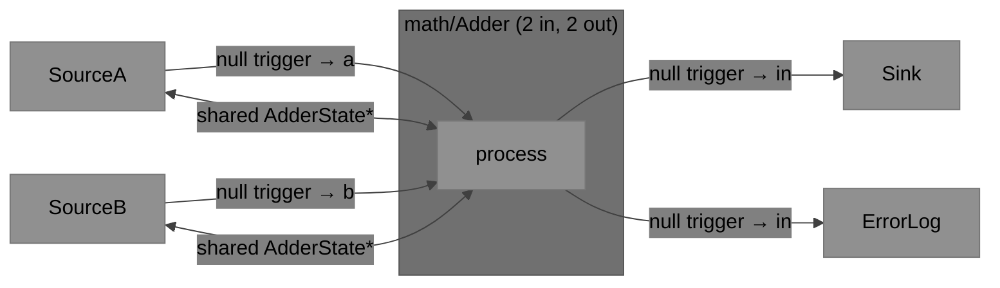

```c
typedef struct {
    double a, b, result;
    bool   has_a, has_b, overflow;
} AdderState;
static AdderState adder_state = {0};

static AFStatus src_a_process(AFComponent comp, const char* in,
                               const AVar* pkt, void* ud)
{
    (void)in; (void)pkt;
    AdderState* s = (AdderState*)ud;
    s->a = read_sensor_a();                  /* native double — no AVar */
    aFlux_componentEmit(comp, "out", NULL);  /* NULL = null trigger */
    return AF_OK;
}

static AFStatus src_b_process(AFComponent comp, const char* in,
                               const AVar* pkt, void* ud)
{
    (void)in; (void)pkt;
    AdderState* s = (AdderState*)ud;
    s->b = read_sensor_b();
    aFlux_componentEmit(comp, "out", NULL);
    return AF_OK;
}

static AFStatus adder_process(AFComponent comp, const char* inport,
                               const AVar* pkt, void* ud)
{
    (void)pkt;                               /* trigger carries no data */
    AdderState* s = (AdderState*)ud;
    if      (strcmp(inport, "a") == 0) s->has_a = true;
    else if (strcmp(inport, "b") == 0) s->has_b = true;
    if (!s->has_a || !s->has_b) return AF_OK;

    s->result   = s->a + s->b;               /* native arithmetic on shared state */
    s->overflow = s->result > 1e6;
    s->has_a = s->has_b = false;

    aFlux_componentEmit(comp, s->overflow ? "err" : "out", NULL);
    return AF_OK;
}

static AFStatus sink_process(AFComponent comp, const char* in,
                              const AVar* pkt, void* ud)
{
    (void)comp; (void)in; (void)pkt;
    AdderState* s = (AdderState*)ud;
    printf("result: %f\n", s->result);       /* read native double directly */
    return AF_OK;
}
```

---

### 5.3 Native: Three-Stage DSP Pipeline with Error Branch

All three stages share a `DSPState` holding a native `float` buffer. Each stage processes
the buffer in-place and emits a null trigger downstream. No AVar involved in any data path.

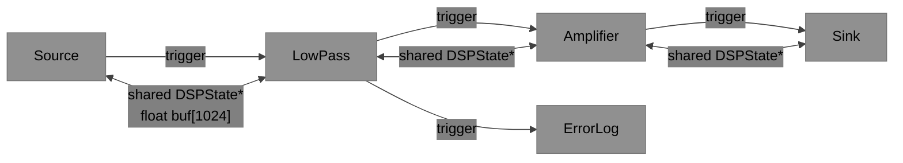

```c
typedef struct { float buf[1024]; size_t len; float gain; } DSPState;
static DSPState dsp = { .len=256, .gain=2.0f };

static AFStatus source_process(AFComponent comp, const char* in,
                                const AVar* pkt, void* ud)
{
    (void)in; (void)pkt;
    DSPState* s = (DSPState*)ud;
    for (size_t i = 0; i < s->len; i++)
        s->buf[i] = sinf((float)i * 0.1f);  /* fill native float buffer */
    aFlux_componentEmit(comp, "out", NULL);  /* NULL = null trigger, no AVar */
    return AF_OK;
}

static AFStatus lowpass_process(AFComponent comp, const char* in,
                                 const AVar* pkt, void* ud)
{
    (void)in; (void)pkt;
    DSPState* s = (DSPState*)ud;
    for (size_t i = 1; i < s->len; i++)      /* in-place filter on native floats */
        s->buf[i] = 0.5f * s->buf[i] + 0.5f * s->buf[i-1];
    aFlux_componentEmit(comp, is_clipping(s->buf, s->len) ? "err" : "out", NULL);
    return AF_OK;
}

static AFStatus amplifier_process(AFComponent comp, const char* in,
                                   const AVar* pkt, void* ud)
{
    (void)in; (void)pkt;
    DSPState* s = (DSPState*)ud;
    for (size_t i = 0; i < s->len; i++)
        s->buf[i] *= s->gain;                /* multiply by native gain */
    aFlux_componentEmit(comp, "out", NULL);
    return AF_OK;
}

static AFStatus sink_process(AFComponent comp, const char* in,
                              const AVar* pkt, void* ud)
{
    (void)comp; (void)in; (void)pkt;
    DSPState* s = (DSPState*)ud;
    write_output(s->buf, s->len);            /* write native floats to output */
    return AF_OK;
}
```

---

### 5.4 Introducing AVar: Data in the Packet

The native examples above share data through `userdata` — components are tightly coupled
via shared memory. `AVar` lets you carry data **in the packet** instead:

- Components become self-contained and reusable — no shared state struct
- Required when components live in different processes or languages
- Required across subgraph boundaries between different runtime instances
- Packet observer always receives `AVar`, so monitoring works without shared pointers

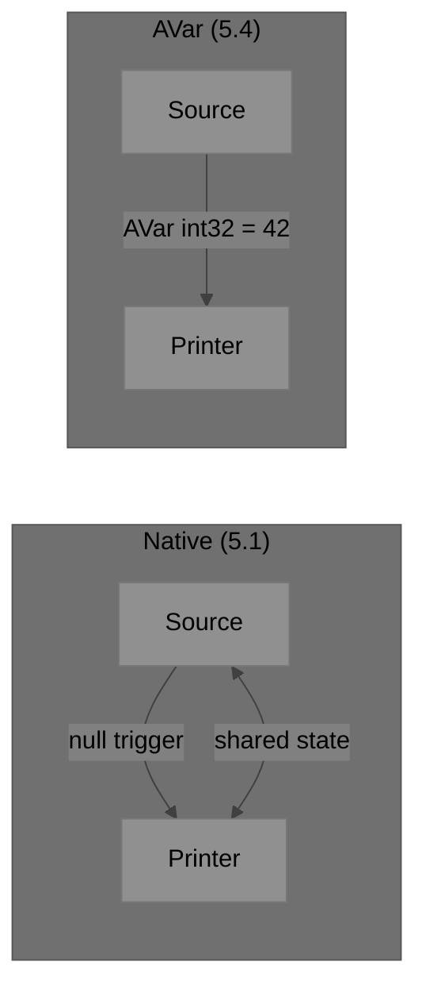

Same two-component pipeline — but now the counter value travels IN the packet. No shared
state; the components are fully decoupled:

```c
static AFStatus source_process(AFComponent comp, const char* in,
                                const AVar* pkt, void* ud)
{
    (void)in; (void)pkt; (void)ud;
    static int count = 0;
    AVar out = {0};
    aVar_setI32(&out, ++count);          /* data IN the packet */
    aFlux_componentEmit(comp, "out", &out);
    aVar_clear(&out);
    return AF_OK;
}

static AFStatus printer_process(AFComponent comp, const char* in,
                                 const AVar* pkt, void* ud)
{
    (void)comp; (void)in; (void)ud;
    printf("count: %d\n", aVar_asI32(pkt));   /* read from packet */
    return AF_OK;
}
```

Multi-type adder — same 2-input/2-output topology as §5.2 but data travels in AVar packets,
so upstream components need no knowledge of each other's state:

```c
static AFStatus adder_process(AFComponent comp, const char* inport,
                               const AVar* pkt, void* ud)
{
    AdderState* s = (AdderState*)ud;
    /* read value directly from the packet — no shared struct needed */
    if      (strcmp(inport, "a") == 0) { s->a = aVar_asDouble(pkt); s->has_a = true; }
    else if (strcmp(inport, "b") == 0) { s->b = aVar_asDouble(pkt); s->has_b = true; }
    if (!s->has_a || !s->has_b) return AF_OK;

    double sum = s->a + s->b;
    s->has_a = s->has_b = false;

    AVar out = {0};
    if (sum > 1e6) {
        aVar_setString(&out, "overflow", /*copy=*/false);
        aFlux_componentEmit(comp, "err", &out);
    } else {
        aVar_setDouble(&out, sum);
        aFlux_componentEmit(comp, "out", &out);
    }
    aVar_clear(&out);
    return AF_OK;
}
```

---

### 5.5 Subgraph with Multiple Exposed Ports and AVar

Subgraph ports always use `AVar` — data crossing a subgraph boundary is carried in
the packet, not via shared state (subgraphs may be in different runtime instances).

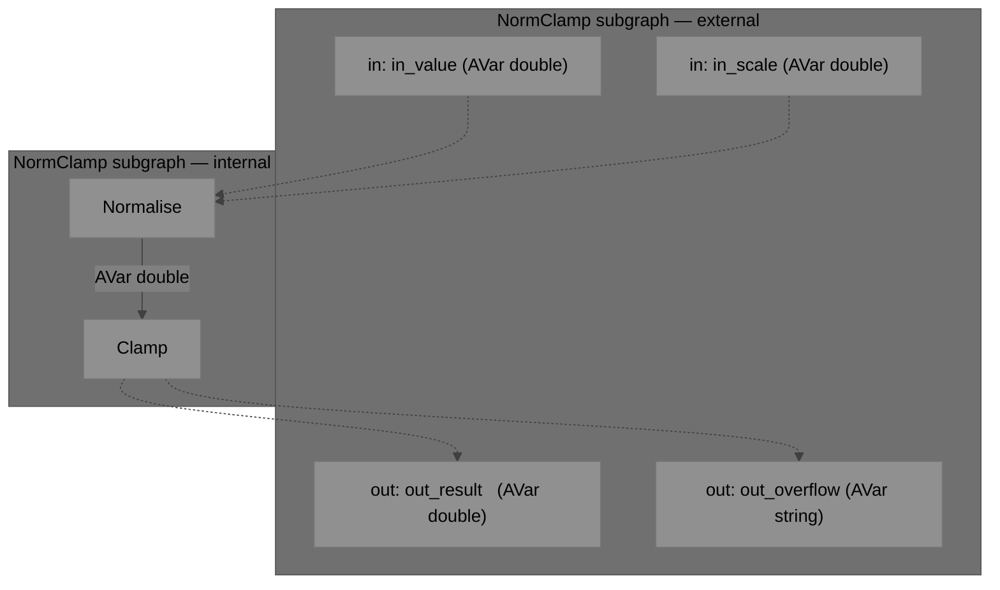

```c
/* Internal Normalise component — receives AVar doubles on two inports */
typedef struct { double value, scale; bool has_v, has_s; } NormState;

static AFStatus norm_process(AFComponent comp, const char* inport,
                              const AVar* pkt, void* ud)
{
    NormState* s = (NormState*)ud;
    if      (strcmp(inport, "value") == 0) { s->value = aVar_asDouble(pkt); s->has_v = true; }
    else if (strcmp(inport, "scale") == 0) { s->scale = aVar_asDouble(pkt); s->has_s = true; }
    if (!s->has_v || !s->has_s) return AF_OK;
    AVar out = {0};
    aVar_setDouble(&out, s->value / (s->scale == 0.0 ? 1.0 : s->scale));
    s->has_v = s->has_s = false;
    aFlux_componentEmit(comp, "out", &out);
    aVar_clear(&out);
    return AF_OK;
}

/* Build and expose the subgraph */
AFGraph sub = aFlux_graphCreateNamed("NormClamp");
aFlux_graphAddComponent(sub, "norm",  aFlux_componentCreate(&norm_desc));
aFlux_graphAddComponent(sub, "clamp", aFlux_componentCreate(&clamp_desc));
aFlux_graphConnect(sub, "norm", "out", "clamp", "in");
aFlux_graphExposeInport (sub, "in_value",     "norm",  "value");
aFlux_graphExposeInport (sub, "in_scale",     "norm",  "scale");
aFlux_graphExposeOutport(sub, "out_result",   "clamp", "out");
aFlux_graphExposeOutport(sub, "out_overflow", "clamp", "over");

/* Parent graph connects to subgraph using the exposed port names */
AFGraph parent = aFlux_graphCreate();
aFlux_graphAddComponent(parent, "src",  aFlux_createComponentByType("dsp/Source"));
aFlux_graphAddComponent(parent, "proc", (AFComponent)sub);
aFlux_graphAddComponent(parent, "sink", aFlux_createComponentByType("dsp/Sink"));
aFlux_graphAddComponent(parent, "err",  aFlux_createComponentByType("core/Output"));
aFlux_graphConnect(parent, "src",  "value",        "proc", "in_value");
aFlux_graphConnect(parent, "src",  "scale",        "proc", "in_scale");
aFlux_graphConnect(parent, "proc", "out_result",   "sink", "in");
aFlux_graphConnect(parent, "proc", "out_overflow", "err",  "in");

AFScheduler sched = aFlux_schedulerCreateThreadPool(2);
aFlux_run(parent, sched);
aFlux_schedulerDestroy(sched);
aFlux_graphDestroy(parent);
```

---

### 5.6 Complex Nested Pipeline with AVar

Two subgraphs chained together; all cross-boundary data travels as AVar packets.

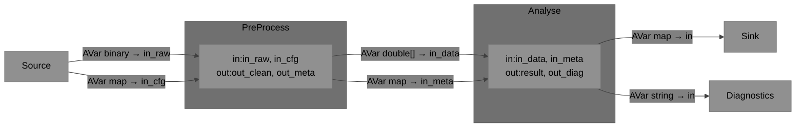

```c
/* PreProcess subgraph */
AFGraph pre = aFlux_graphCreateNamed("PreProcess");
/* ... build internal components ... */
aFlux_graphExposeInport (pre, "in_raw",    "decode", "raw");
aFlux_graphExposeInport (pre, "in_cfg",    "decode", "cfg");
aFlux_graphExposeOutport(pre, "out_clean", "filter", "out");
aFlux_graphExposeOutport(pre, "out_meta",  "meta",   "out");

/* Analyse subgraph */
AFGraph ana = aFlux_graphCreateNamed("Analyse");
/* ... build internal components ... */
aFlux_graphExposeInport (ana, "in_data",  "fft",    "in");
aFlux_graphExposeInport (ana, "in_meta",  "label",  "meta");
aFlux_graphExposeOutport(ana, "result",   "output", "out");
aFlux_graphExposeOutport(ana, "out_diag", "diag",   "out");

/* Parent graph */
AFGraph parent = aFlux_graphCreate();
aFlux_graphAddComponent(parent, "src",  aFlux_createComponentByType("io/Source"));
aFlux_graphAddComponent(parent, "pre",  (AFComponent)pre);
aFlux_graphAddComponent(parent, "ana",  (AFComponent)ana);
aFlux_graphAddComponent(parent, "sink", aFlux_createComponentByType("io/Sink"));
aFlux_graphAddComponent(parent, "diag", aFlux_createComponentByType("core/Output"));
aFlux_graphConnect(parent, "src", "raw",       "pre", "in_raw");
aFlux_graphConnect(parent, "src", "cfg",       "pre", "in_cfg");
aFlux_graphConnect(parent, "pre", "out_clean", "ana", "in_data");
aFlux_graphConnect(parent, "pre", "out_meta",  "ana", "in_meta");
aFlux_graphConnect(parent, "ana", "result",    "sink","in");
aFlux_graphConnect(parent, "ana", "out_diag",  "diag","in");

AFScheduler sched = aFlux_schedulerCreateThreadPool(4);
aFlux_run(parent, sched);
aFlux_schedulerDestroy(sched);
aFlux_graphDestroy(parent);
```

---

## 6. Built-in Core Components

Every AnyFlux implementation MUST provide:

| Type name | Inports | Outports | Behaviour |
|---|---|---|---|
| `core/Repeat` | `in` | `out` | Forwards packet unchanged |
| `core/Drop` | `in` | — | Discards packet silently |
| `core/Output` | `in` | — | Emits to runtime outport or stdout |
| `core/Split` | `in` | `out[N]` | Fans out to all connected outports |
| `core/Merge` | `in[N]` | `out` | Forwards from any connected inport |
| `core/Config` | — | `*` | Emits IIP values on named outports at start |

---

## 7. Embedded / Compile-Time Options

| CMake option | Preprocessor flag | Effect |
|---|---|---|
| `AF_NO_HEAP` | `AF_NO_HEAP` | Disable heap; use static allocation pools |
| `AF_NO_THREADS` | `AF_NO_THREADS` | Disable thread-pool scheduler and internal mutex |
| `AF_NO_PROTOCOL` | `AF_NO_PROTOCOL` | Exclude FBP Protocol adapter |
| `AF_NO_SERIALIZATION` | `AF_NO_SERIALIZATION` | Exclude JSON/CBOR graph serialization |
| `AF_NO_MAP` | `AF_NO_MAP` | Disable map packet type |
| `AF_STATIC_COMPONENTS` | `AF_STATIC_COMPONENTS` | Compile-time-only registry |
| `AF_MAX_COMPONENTS` | `AF_MAX_COMPONENTS=N` | Static registry size |
| `AF_MAX_CONNECTIONS` | `AF_MAX_CONNECTIONS=N` | Static connection pool size |
